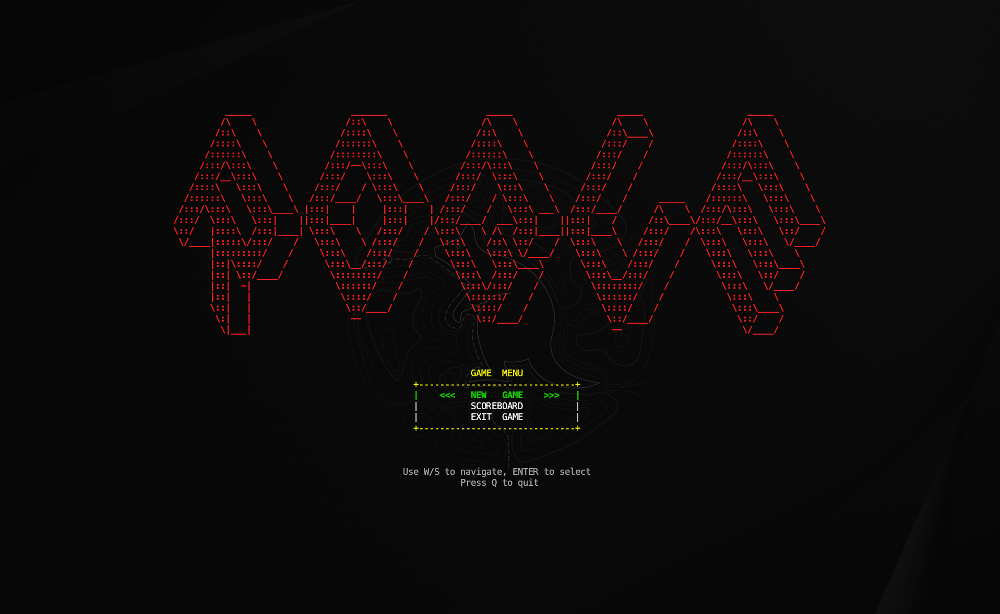
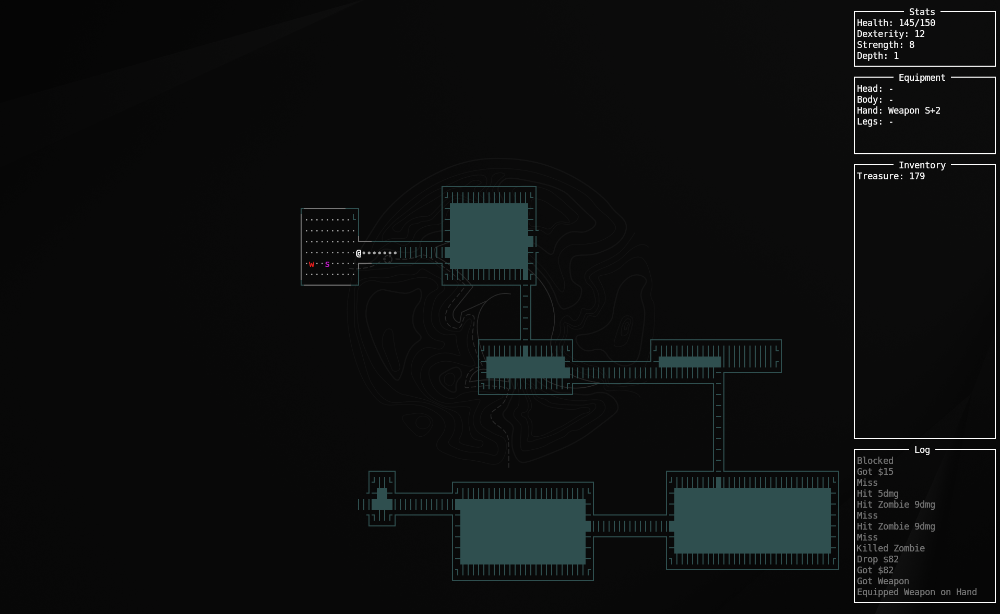

A console-based rogue-like game in Go, inspired by the classic 1980 game *Rogue*. Learning project.




## Requirements

* Go 1.21 or later
* [tcell](https://github.com/gdamore/tcell)

## Build

```bash
make build
make run
```
## Controls

**Movement:**
- `W` / `S` / `A` / `D` — up / down / left / right

**Items:**
- `H` — use weapon
- `R` — use armor
- `J` — use food
- `K` — use elixir
- `E` — use scroll

**Inventory:**
- `I` — equip item
- `U` — unequip item
- `X` — drop item

**Menu:**
- `↑` / `↓` — navigate
- `Enter` — confirm
- `Esc` — cancel / back
- `Q` — quit to menu

**Item Selection:**
- `↑` / `↓` — select
- `Enter` — use
- `Esc` — cancel
